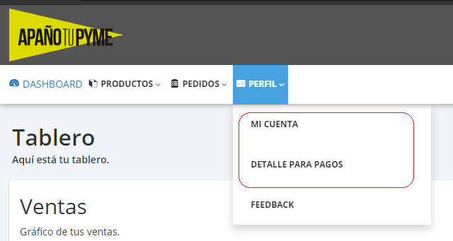
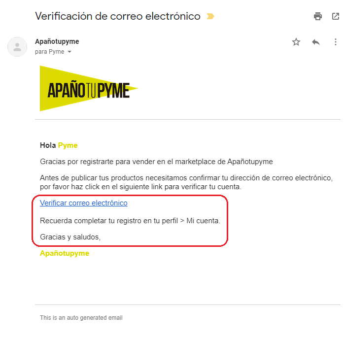

# Registro de Pyme

## Crear Usuario

Para crear un usuario de Pyme ingrese a [Registro ApañoTuPyme](/join/atp)

Luego dirígete a [ApañoTuPyme Dashboard](https://pyme.apanotupyme.cl/index.php?p=login) para hacer login y poder completar los datos necesarios para terminar el registro.

## Actualizar Datos

Después de ingresar vas a ver en la esquina superior izquierda 4 ítems:

- Dashboard: "Muestra el desempeño de venta de tus productos o servicios"
- Productos: "Permite cargar productos y servicios"
- Pedidos: "Muestra ventas realizadas y información de los clientes"
- Perfil : "Tiene información de la pyme y datos bancarios para poder generar los pagos"

Ahora es necesario completar la información de tu pyme para que podamos hacer depósitos a tu cuenta del banco. :smiley:. Dirígete a "Mi Cuenta" y "Detalles para Pagos".

En "Detalles Para Pago" por favor siga las siguientes especificaciones:

- Método de Pago: Ingresar "Internet Banking"
- Banco: Nombre de banco (debe ser chileno)
- Rut: "Rut del titular de la cuenta"
- Otra Información: "cualquier información adicional para realizar el pago y **especificar el tipo cuenta bancaria** (Vista, Corriente, ETC)"

## Verificar Email

Es importante que verifique su mail para que podamos informar cuando vende algún producto o servicio y para darle a conocer los beneficios de ser parte de nuestra comunidad **ApañoTyPyme** :tada: :100: :zap: :fire: :boom:

Para recibir email de confirmación pinche el siguiente botón **Obtener enlace de verificación** en [ApañoTuPyme Dashboard](https://pyme.apanotupyme.cl/index.php?p=login).

Entre a la casilla de Email utilizado en el registro y busque el siguiente Email de confirmación:

Pinche en el link de verificación!
::: warning
Este Email puede tardar algunos minutos en llegar, pero no te preocupes, puedes hacer este paso después y por mientras seguir con el manual. Solo recuerda hacerlo después!! Si no llega envíanos un Email a [Contactanos](./contact.html)!!
:::

## Tienda Física

Si tienes una tienda física :convenience_store:  te recomendamos rellenar tu perfil, para que así aparezcas en las búsquedas de los compradores!

Dentro de [ApañoTuPyme Dashboard](https://pyme.apanotupyme.cl/index.php?p=dashboard) diríjase a "Perfil" :point_right: "Mi Cuenta".

Bajar a Información extra y ahí se te preguntará si tiene(s) tienda(s) física(s). Además indícanos en que región queda! Esto ayudará para que el buscador muestre tu tienda en las búsquedas correspondientes! :raised_hands:

::: tip
 ¡Poner la comuna también en direcciones de tu local para que sepan exactamente dónde estás! :round_pushpin:
:::

¿Tienes más de una tienda? No hay problema, rellena el campo "direcciones de otras tiendas".

El la sección de la derecha se encuentra **Logo De La Tienda / Empresa**

El logotipo de la tienda se puede cargar en cualquier dimensión, pero le recomendamos que cargue la imagen con una dimensión de 165x165 px. Recuerde clickear **CARGAR Y GUARDAR** para subir la imagen.

## Cargar Logo

Para finalizar el registro de su pyme sólo falta cargar el logo y la pyme estará lista para subir y vender productos y servicios. :money_with_wings:
::: tip
Subir el logo y banner de la Pyme ayudará sustancialmente a tener más visibilidad y lograr más ventas.
:::
Dentro de [ApañoTuPyme Dashboard](https://pyme.apanotupyme.cl/index.php?p=login) diríjase a "Perfil" :point_right: "Mi Cuenta"

El la sección de la derecha se encuentra **Logo De La Tienda / Empresa**

El logotipo de la tienda se puede cargar en cualquier dimensión, pero le recomendamos que cargue la imagen con una dimensión de 165x165 px. Recuerde clickear **CARGAR Y GUARDAR** para subir la imagen.

::: warning
No es necesario subir **PERFIL DEL VENDEDOR Y ESTADO** o **IMAGEN DEL BANNER SUPERIOR DE TIENDA**
:::

